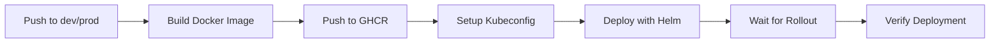

# GitHub Actions CI/CD Setup

This guide explains how to set up automated deployment for the CCXT Bot using GitHub Actions.

## Overview

The workflow automatically:
1. Builds Docker image for the server
2. Pushes to GitHub Container Registry (ghcr.io)
3. Deploys to Kubernetes using Helm
4. Waits for deployment to be ready

## Workflow Trigger

The workflow runs on push to:
- `dev` branch → deploys to development environment
- `prod` branch → deploys to production environment

## Required GitHub Secrets

Configure these secrets in your GitHub repository settings (Settings → Secrets and variables → Actions):

### 1. GitHub Container Registry Token

**Secret name:** `GHCR_TOKEN`

**How to create:**
```bash
# 1. Go to GitHub Settings → Developer settings → Personal access tokens → Tokens (classic)
# 2. Generate new token with these scopes:
#    - write:packages
#    - read:packages
#    - delete:packages (optional)
# 3. Copy the token and add as GHCR_TOKEN secret
```

### 2. Kubernetes Config (per environment)

**Secret names:**
- `dev_KUBECONFIG` - for development environment
- `prod_KUBECONFIG` - for production environment

**How to create:**
```bash
# 1. Get your kubeconfig file (usually ~/.kube/config)
# 2. Base64 encode it
cat ~/.kube/config | base64 -w 0

# 3. Add the base64 string as a secret:
#    - For dev: dev_KUBECONFIG
#    - For prod: prod_KUBECONFIG
```

**For Linode Kubernetes:**
```bash
# Download kubeconfig from Linode Cloud Manager
# Or use Linode CLI:
linode-cli lke kubeconfig-view <cluster-id> --text | base64 -w 0
```

### 3. Doppler Token (per environment)

**Secret names:**
- `dev_DOPPLER_TOKEN` - for development environment
- `prod_DOPPLER_TOKEN` - for production environment

**How to create:**
```bash
# 1. Go to Doppler Dashboard: https://dashboard.doppler.com/
# 2. Select your project
# 3. Go to Access → Service Tokens
# 4. Create a token for each environment:
#    - Create "dev" config token → add as dev_DOPPLER_TOKEN
#    - Create "prod" config token → add as prod_DOPPLER_TOKEN
# 5. Token format: dp.st.{env}.XXXXXXXXXXXXX
```

## Secret Naming Convention

The workflow uses dynamic secret selection based on branch name:

```yaml
# Format: {branch_name}_{SECRET_NAME}
KUBECONFIG_SECRET: ${{ secrets[format('{0}_KUBECONFIG', github.ref_name)] }}
DOPPLER_TOKEN: ${{ secrets[format('{0}_DOPPLER_TOKEN', github.ref_name)] }}
```

**Example:**
- Push to `dev` branch → uses `dev_KUBECONFIG` and `dev_DOPPLER_TOKEN`
- Push to `prod` branch → uses `prod_KUBECONFIG` and `prod_DOPPLER_TOKEN`

## Workflow Environment Variables

Set in [.github/workflows/deploy.yaml](.github/workflows/deploy.yaml):

```yaml
env:
  NAME: ccxt-bot
  DOCKER_REGISTRY: ghcr.io
  DOCKER_ORG: berryhill  # Change to your GitHub username/org
  DOCKER_TAG: ${{ github.sha }}  # Uses git commit SHA
  GITHUB_USER: berryhill  # Change to your GitHub username
```

**Update these values:**
- `DOCKER_ORG` - Your GitHub username or organization
- `GITHUB_USER` - Your GitHub username

## Docker Image Naming

Images are tagged with:
- Git commit SHA: `ghcr.io/berryhill/ccxt-bot-server:abc123def`
- Latest tag: `ghcr.io/berryhill/ccxt-bot-server:latest`

## Deployment Flow



### Job: build-push-server

1. Checkout code
2. Login to GitHub Container Registry
3. Build Docker image from `server/Dockerfile`
4. Push with commit SHA and latest tags

### Job: deploy

Requires `build-push-server` to succeed.

1. Checkout code
2. Validate secrets are present
3. Setup Kubeconfig from base64-encoded secret
4. Verify Kubernetes connection
5. Install/upgrade Helm chart with:
   - Environment-specific values file (`values-dev.yaml` or `values-prod.yaml`)
   - Doppler token override
   - Docker image with commit SHA
6. Wait for deployment rollout (5 minute timeout)
7. Display deployment status and ingress URLs

## First-Time Setup Checklist

- [ ] Update `DOCKER_ORG` in workflow file to your GitHub username
- [ ] Update `GITHUB_USER` in workflow file to your GitHub username
- [ ] Create `GHCR_TOKEN` secret in GitHub repo
- [ ] Create `dev_KUBECONFIG` secret (base64-encoded)
- [ ] Create `prod_KUBECONFIG` secret (base64-encoded)
- [ ] Create `dev_DOPPLER_TOKEN` secret from Doppler dashboard
- [ ] Create `prod_DOPPLER_TOKEN` secret from Doppler dashboard
- [ ] Create `dev` and `prod` branches in your repo
- [ ] Update Helm values files with correct hostnames
- [ ] Test deployment by pushing to `dev` branch

## Testing the Workflow

### 1. Test Development Deployment

```bash
# Make a change and push to dev
git checkout dev
git add .
git commit -m "Test deployment"
git push origin dev

# Watch the workflow in GitHub Actions tab
# Check deployment status
kubectl get pods -n trading
kubectl get ingress -n trading
```

### 2. Test Production Deployment

```bash
# Merge dev to prod
git checkout prod
git merge dev
git push origin prod

# Watch the workflow in GitHub Actions tab
```

## Workflow Outputs

The workflow provides detailed output:

```
📊 Deployment Status:
NAME                              READY   STATUS    RESTARTS   AGE
pod/ccxt-bot-server-xxx-yyy       1/1     Running   0          2m
pod/ccxt-bot-mongodb-xxx-yyy      1/1     Running   0          5m

🌐 Ingress URLs:
NAME                HOSTS
ccxt-bot-ingress    dev.ccxt-bot.example.com

📦 Image deployed:
ghcr.io/berryhill/ccxt-bot-server:abc123def456
```

## Troubleshooting

### Error: "KUBECONFIG is empty"

**Cause:** Secret not found or incorrectly named

**Solution:**
```bash
# Verify secret name matches branch
# For dev branch: dev_KUBECONFIG
# For prod branch: prod_KUBECONFIG

# Re-create the secret with correct base64 encoding
cat ~/.kube/config | base64 -w 0
# Add to GitHub secrets
```

### Error: "cannot connect to Kubernetes cluster"

**Cause:** Invalid kubeconfig or expired credentials

**Solution:**
```bash
# Download fresh kubeconfig from your Kubernetes provider
# Re-encode and update GitHub secret
cat fresh-kubeconfig.yaml | base64 -w 0
```

### Error: "DOPPLER_TOKEN is empty"

**Cause:** Doppler token secret not configured

**Solution:**
1. Go to Doppler dashboard
2. Create service token for the environment
3. Add to GitHub secrets as `{branch}_DOPPLER_TOKEN`

### Error: "Error: UPGRADE FAILED: context deadline exceeded"

**Cause:** Deployment took longer than 5 minutes

**Solution:**
- Check pod logs: `kubectl logs -n trading deployment/ccxt-bot-server`
- Check events: `kubectl get events -n trading --sort-by='.lastTimestamp'`
- Increase timeout in workflow or fix slow startup

### Error: "Error: release: not found"

**Cause:** First deployment to the cluster

**Solution:** This is normal for first deployment, the workflow will create the release.

## Manual Deployment

If you need to deploy manually:

```bash
# Build and push Docker image
docker build -t ghcr.io/berryhill/ccxt-bot-server:manual ./server
docker push ghcr.io/berryhill/ccxt-bot-server:manual

# Deploy with Helm
helm upgrade --install ccxt-bot ./helm \
  -f ./helm/values-dev.yaml \
  --namespace trading --create-namespace \
  --set server.doppler.token="$DOPPLER_TOKEN" \
  --set server.image.repository="ghcr.io/berryhill/ccxt-bot-server" \
  --set server.image.tag="manual"
```

## Security Best Practices

1. **Never commit secrets** - Always use GitHub Secrets
2. **Use service accounts** - Don't use personal credentials
3. **Rotate tokens regularly** - Especially Doppler tokens
4. **Limit kubeconfig permissions** - Use namespace-scoped service accounts
5. **Enable branch protection** - Require PR reviews for prod branch
6. **Use environments** - Configure GitHub Environments for additional protection

## Advanced Configuration

### Using GitHub Environments

Add environment protection rules:

1. Go to Settings → Environments
2. Create `dev` and `prod` environments
3. Add protection rules for `prod`:
   - Required reviewers
   - Wait timer
   - Deployment branches (only prod branch)

Update workflow:
```yaml
deploy:
  needs: [build-push-server]
  runs-on: ubuntu-latest
  environment: ${{ github.ref_name }}  # Uses GitHub Environment
```

### Slack Notifications

Add to the end of deploy job:

```yaml
- name: Notify Slack
  if: always()
  uses: slackapi/slack-github-action@v1
  with:
    payload: |
      {
        "text": "Deployment ${{ job.status }}: ${{ github.ref_name }}",
        "blocks": [
          {
            "type": "section",
            "text": {
              "type": "mrkdwn",
              "text": "Deployment *${{ job.status }}* for `${{ github.ref_name }}`\nCommit: ${{ github.sha }}"
            }
          }
        ]
      }
  env:
    SLACK_WEBHOOK_URL: ${{ secrets.SLACK_WEBHOOK_URL }}
```

## Next Steps

1. Set up all required secrets
2. Test deployment to dev environment
3. Configure monitoring and alerting
4. Set up log aggregation
5. Add health check endpoints
6. Configure auto-scaling (HPA)
7. Set up backup and disaster recovery
